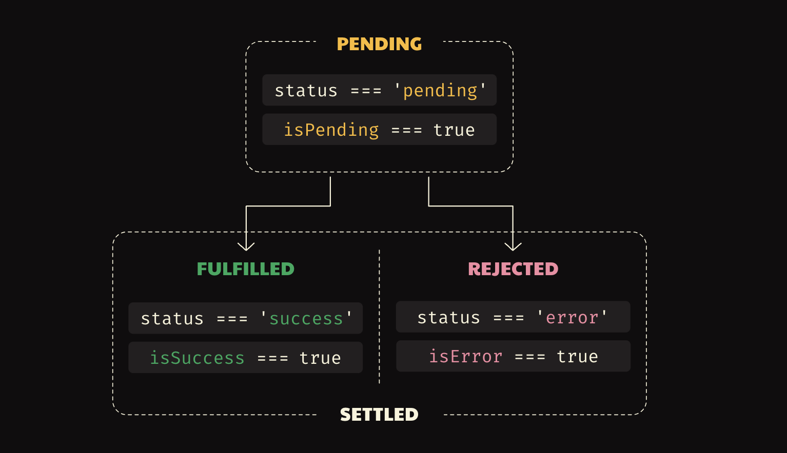

### How React Query works:

https://martinfowler.com/bliki/TwoHardThings.html

React Query is a library for managing server state in React applications. It provides a way to fetch, cache, and update data in your application.

React Query works by using a query key to identify a piece of data. When you call useQuery, React Query will check if the data is already in the cache. If it is, React Query will return the data from the cache. If it is not, React Query will fetch the data from the server and store it in the cache.


### React Query life cycle 



```tsx
function MediaDevices() {
  const { data, isPending, isError } = useQuery({
    queryKey: ['mediaDevices'],
    queryFn: () => {
      return navigator.mediaDevices.enumerateDevices()
    }
  })

  if (isPending === true) {
    return <div>...</div>
  }

  if (isError === true) {
    return <div>We were unable to access your media devices</div>
  }

  return (
    <ul>
      {data.map((device) => (
        <li key={device.deviceId}>{device.label}</li>
      ))}
    </ul>
  )
}
```


### isFetching vs isLoading: 
**isFetching > isLoading**
- **isFetching** : async query function hasn't yet resolved
- **isLoading**: no cached data, plus isFetching


### React Query stateTime and gcTime:
- Fresh and in cache:
    - Display cached data, no refetch
- stateTime and in cache:
    - Display cached data, refetch in the background
- Not in cache:
    - Nothing to display during fetching
- gcTime is how long to keep the data in the cache after it is no longer needed.

#### How does React Query know when to refetch data?
1. the queryKey changes
2. A new observer mounts
3. The window receives a focus event
4. The device goes offline

 ```tsx
 useQuery({
  queryKey: ['repos', { sort }],
  queryFn: () => fetchRepos(sort),
  refetchOnMount: false,
  refetchOnWindowFocus: false,
  refetchOnReconnect: false,
})
 ```